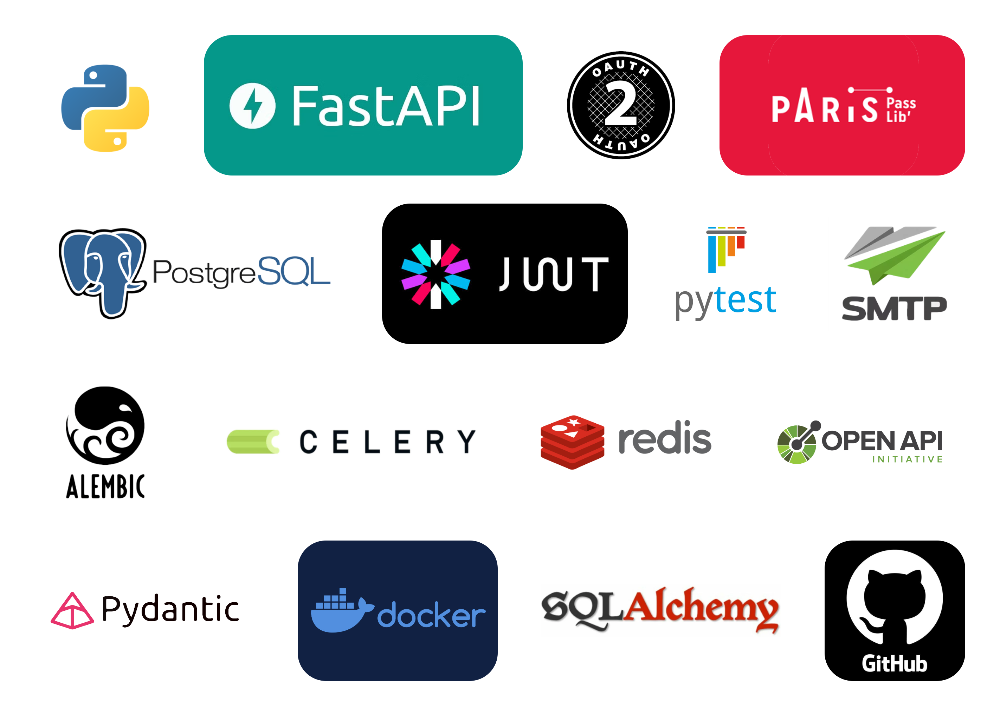
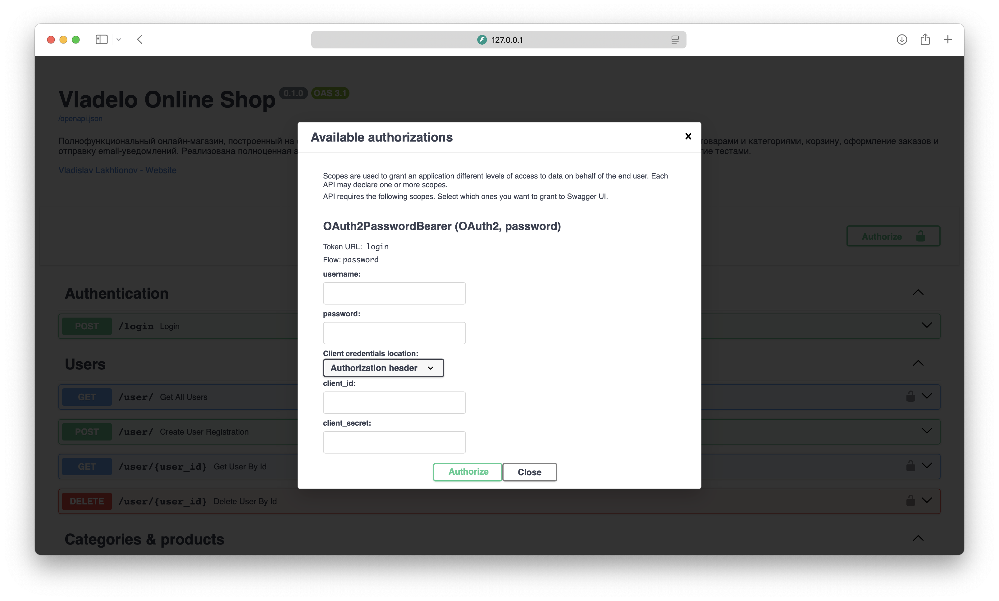
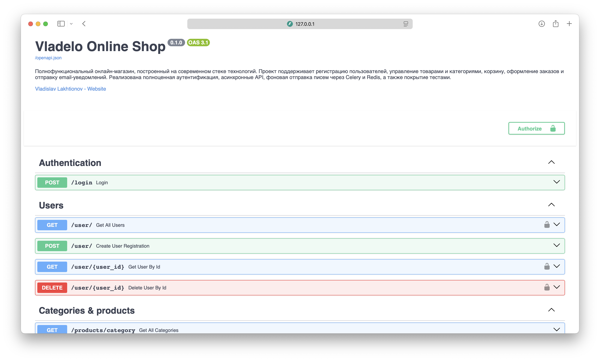
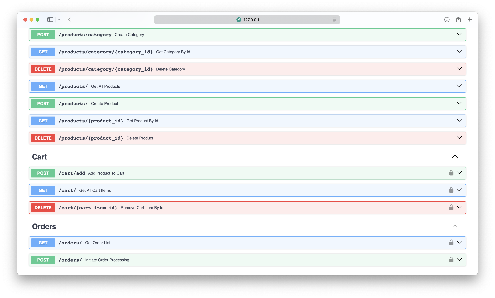
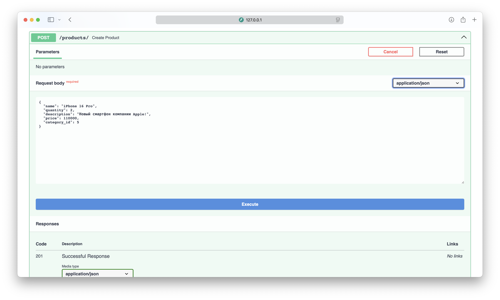
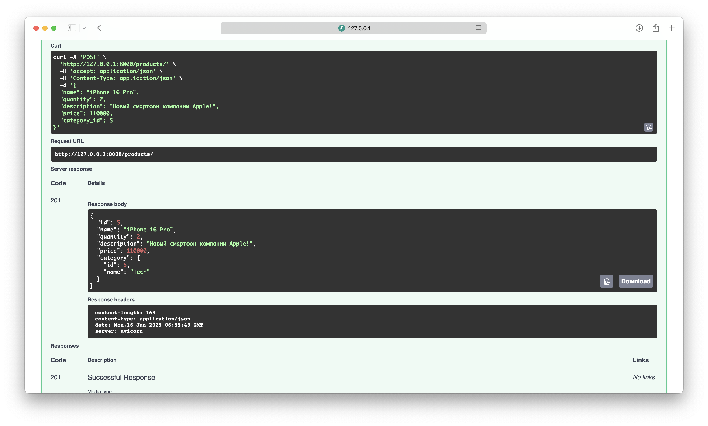

<p align="left">
  
  
  
  
  
  
  
  
  
  
</p>

# 🛍️ FastAPI Online Shop

FastAPI Online Shop — это полнофункциональное e-commerce API-приложение, построенное с использованием FastAPI,
SQLAlchemy, PostgreSQL и Celery с Redis.



## 🚀 Возможности

- 📦 Управление продуктами и категориями
- 🛒 Добавление и удаление товаров из корзины
- 🧾 Оформление заказов
- ✅ Аутентификация через JWT
- 📧 Уведомление по email при оформлении заказа
- 🧵 Асинхронные задачи через Celery и Redis
- 🧪 Unit тесты с использованием Pytest и httpx

## 📸 Примеры работы

### 🔐 Аутентификация



### 🔍 Общий вид




### 📦 Создание товара




## 🧰 Технологический стек

- **Язык:** Python 3.11+
- **Фреймворк:** FastAPI
- **Асинхронность:** asyncio, httpx
- **База данных:** PostgreSQL (через SQLAlchemy ORM)
- **Миграции базы данных:** Alembic
- **Схемы данных и валидация:** Pydantic v2
- **Аутентификация:** OAuth2, JWT
- **Хеширование паролей:** Passlib + Bcrypt
- **Очереди фоновых задач:** Celery + Redis
- **Тестирование:** Pytest + pytest-asyncio
- **Работа с email:** SMTP (используется Yandex)
- **Документация:** OpenAPI (автоматически через Swagger UI)

## 📂 Структура проекта

```
FastAPI-Online-Shop/
├── Dockerfile                  # Конфигурация Docker для контейнеризации приложения
├── docker-compose.yml          # Оркестрация сервисов (БД, кеш, воркеры)
├── README.md                   # Документация проекта
├── requirements.txt            # Список зависимостей Python
├── main.py                     # Точка входа FastAPI приложения
├── conf_test_db.py             # Настройки тестовой БД
├── Vladelo Online Shop.png     # Схематичное изображение проекта
│
├── alembic/                    # Миграции базы данных
│   ├── env.py
│   ├── script.py.mako
│   └── versions/               # Файлы версий миграций
│
├── ecommerce/                  # Основной пакет приложения
│   ├── __init__.py
│   ├── config.py               # Настройки проекта
│   ├── db.py                   # Инициализация SQLAlchemy и подключение к БД
│   │
│   ├── auth/                   # Аутентификация и авторизация
│   │   ├── jwt.py              # JWT-токены
│   │   ├── router.py           # Эндпоинты auth
│   │   └── shema.py            # Pydantic-схемы для auth
│   │
│   ├── user/                   # Работа с пользователями
│   │   ├── models.py
│   │   ├── router.py
│   │   ├── services.py         # Логика работы с пользователями
│   │   ├── hashing.py
│   │   ├── validator.py
│   │   └── shema.py
│   │
│   ├── products/               # Каталог товаров
│   │   ├── models.py
│   │   ├── router.py
│   │   ├── services.py
│   │   ├── validator.py
│   │   └── shema.py
│   │
│   ├── cart/                   # Корзина покупок
│   │   ├── models.py
│   │   ├── router.py
│   │   ├── services.py
│   │   └── shema.py
│   │
│   └── orders/                 # Заказы
│       ├── models.py
│       ├── router.py
│       ├── services.py
│       ├── tasks.py            # Асинхронные задачи (Celery)
│       ├── worker.py           # Воркеры для задач
│       ├── mail.py             # Отправка уведомлений
│       └── shema.py
│
├── docs/                       # Скриншоты и документация проекта
│
└── tests/                      # Тесты приложения
    ├── conftest.py             # Общие фикстуры
    ├── user/                   # Тесты для пользователей
    ├── products/               # Тесты для товаров
    ├── cart/                   # Тесты для корзины
    ├── orders/                 # Тесты для заказов
    ├── login/                  # Тесты логина
    ├── registration/           # Тесты регистрации

```

## ⚙️ Установка и запуск

```bash
# 1. Клонируй репозиторий
git clone https://github.com/vladelo777/FastAPI-Online-Shop.git
cd FastAPI-Online-Shop

# 2. Создай виртуальное окружение
python -m venv .venv
source .venv/bin/activate

# 3. Установи зависимости
pip install -r requirements.txt

# 4. Настрой переменные окружения
cp .env.template .env

# 5. Примените миграции Alembic
alembic upgrade head

# 6. Запуск сервера FastAPI
uvicorn main:app --reload

# 7. Запуск Redis (если не запущен)
brew services start redis  # macOS
# redis-server             # Linux/WSL

# 8. Запуск Celery
celery -A ecommerce.orders.worker.celery_app worker --loglevel=info

## 🧪 Запуск тестов

```bash
pytest
```

## ⚙️ Переменные окружения

Файл `.env.template` для всех необходимых переменных.

## 📬 **Контакты**

Автор: Владислав Лахтионов  
GitHub: [vladelo-code](https://github.com/vladelo-code)  
Gitverse: [vladelo](https://gitverse.ru/vladelo/)  
Telegram: [@vladelo](https://t.me/vladelo)

💌 Не забудьте поставить звезду ⭐ на GitHub, если вам понравился проект! 😉